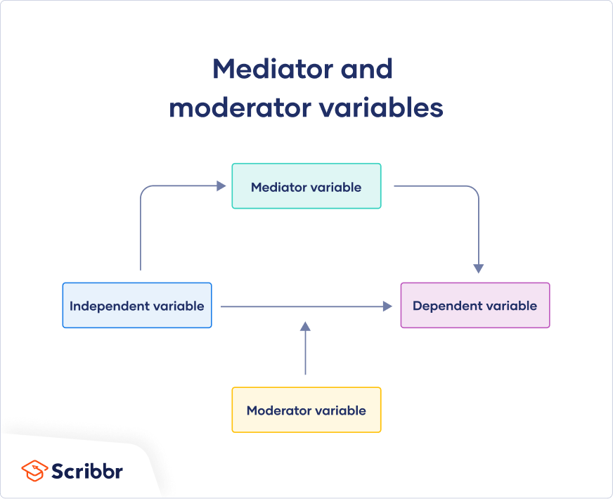

## What Is Health Behaviour?

> 'Any activity undertaken by a person believing themselves to be healthy for the purposes of preventing disease, or detecting it at an asymptomatic stage'

-   Definition by Kasl & Cobb (1966) did not account for exercise, weight control, appearance, or maintaining social contacts.
-   Engaging in health behaviours may still prevent disease

> '...behaviour performed by an individual regardless of his/her perceived health status, with the purpose of protecting, promoting, or maintaining his/her health.'

-   Definition by Harris & Guten (1979) includes the behaviours of unhealthy people, such as a person with heart disease exercising to prevent progression of the disease.

**Behavioural Pathogens**: A behavioural practise considered damaging to our health (e.g. smoking).
**Behavioural Immunogen**: A health protective behavioural practise such as exercise.

-   The development of medical understanding has changed our perspectives on health behaviour (e.g. smoking, drinking, exercise, sun exposure)
-   A longitudinal study conducted from 1963 - 1999 has determined the key behavioural factors associated with longevity:
      -   Sleeping 7 - 8 hours a night
      -   Not Smoking
      -   Consuming 1 - 2 alcoholic drinks per week (or less)
      -   Regular Exercise
      -   Not eating between meals
      -   Eating Breakfast
      -   Being no more than 10% overweight.
-   Men and women performing 6 out of the 7 of these behaviours, live an additional 7 and 11 years respectively than those performing less than 6.
-   Not snacking or not eating breakfast was later shown to have no bearing on longevity.
-   To truly understand health behaviours, we also need to understand the psychological and social factors contributing to the adoption or avoidance of health behaviours.

### Distal Influences on Health Behaviour

-   Distal (away from the body) influences on behaviour (such as culture, environment, ethnicity, socioeconomic status, age, gender and personality) indirectly impact our health behaviours through proximal factors (beliefs, attitudes and goals).

### Demographic Influences

-   Highest amount of heath behaviour change evident in late teens, early adulthood where we take on the habits of peers (as well as siblings) rather than parents or other adults.
-   Markers if higher risk taking, taking up smoking or drinking, and initiating 'risk' behaviours.
-   Gender can also be a marker of particular health risks or benefits (such as men avoiding seeing their doctor), with men more likely to engage in health risk behaviours than women.
-   Exercise can be a demonstration of increased health promoting behaviours, which can also serve as a way of mitigating the negative judgements of other men while not drinking as much.
-   The topic of men's health continues to be a point of concern over the general absence of support from medical health professionals in encouraging and supporting men in seeking assistance.

### Personality

-   Eyesenck's three factor model
      -   **Extroversion**: outgoing, social nature
      -   **Neuroticism**: anxious, worried, guilt-ridden nature
      -   **Psychoticism**: egocentric, aggressive, antisocial
-   Big 5
      -   Openness
      -   Conscientiousness
      -   Extroversion
      -   Agreeableness
      -   Neuroticism
-   4 of the 5 (except for conscientiousness) personality traits have been validated within different cultures and at different points in the lifespan from age 14 to 50+
-   Health risk taking behaviour has been observed as high in those who test high in extroversion, neuroticism and openness.
-   Health promoting factors are evident in those scoring high on the agreeable and conscientiousness scales.
-   High levels of neuroticism have also been linked to greater use of healthcare. Highly neurotic individuals are more likely to pay greater attention to bodily sensations.

#### Other aspects of Personality

-   Locus of Control (LoC)
      -   **Internal**: placing responsibility of outcomes on themselves, and consider that their actions effect outcomes.
      -   **External**: place responsibility of outcomes on external factors such as luck.
      -   A multidimensional health locus of control which identifies three independent dimensions:
          -   **Internal**: Strong internal beliefs in which the individual considers themselves as the primary determinant of their health state. Often associated with high levels of health protective behaviours and self-efficacy (Bandura)
          -   **External**: Heavily reliant on luck, fate or chance as a health determinant, rather than own behaviour.
          -   **Powerful Others**: consider the actions of health professionals to be strong determinants of our own health status.
;,