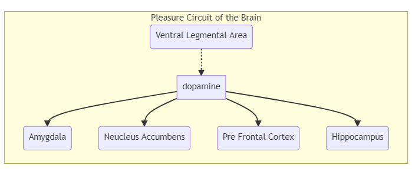

  <h4>Terms</h4>
  <ul>
    <li><abbr title="continued involvement with a substance or activity despite ongoing negative consequences.">Addiction</abbr></li>
    <li><abbr title="The adaptive state of brain and body processes that occurs with regular addictive behaviour and results in withdrawal if the addictive behaviour stops.">Physiological Dependence</abbr></li>
    <li><abbr title="A requirement for increased amounts of a drug in order to achieve the desired effect">Tolerance</abbr></li>
    <li><abbr title=" a series of temporary physical and psychological symptoms that occurs when substance use stops.">Withdrawal</abbr></li>
    <li><abbr title="Dependency of the mind on a substance or behaviour, which can lead to psychological withdrawal symptoms such as anxiety, irritability, or cravings.">Physiological Dependence</abbr></li>
  </ul>

### What Is Addiciton?

### Common Characteristics of Addiction

  
Although the mechanism is not well understood, all forms of addiction probably reflect dysfunction of certain biochemical systems in the brain.

 

 

-   **Compulsion**: An excessive preoccupation (characterised by **obsession**) with a behaviour and an overwhelming need to engage in an activity.
-   **Loss of Control**: An inability to realistically estimate the consequences (healthy or damaging) of a particular behaviour.
-   **Negative consequences**: physical damage, legal trouble, financial problems, academic failure or family dissolution.
-   **Denial**: inability to perceive that a behaviour is self-destructive
-   **Inability to Abstain**
  
  <h5>Harmful Use</h5>
    
Defined as harm being caused to the health of the person, such as hepatitis (in the case of intravenous drug use) or a mood disorder (secondary to the use of alcohol)

  <h5>Dependence Syndrome</h5>
    
A dependence syndrome is a cluster of physiological, behavioural and cognitive phenomena in which the use of a substance takes on a much higher priority than other behaviours that once had greater value for the individual.

    
This syndrome can also be referred to as the frequently strong, or overpowering desire to take substance(s)

  <h5>Addiction Effects Family and Friends</h5>
    
Family members of an addicted person often suffer from <abbr title="A self-defeating relationship pattern in which a person helps (by protecting the addicted person from the consequences of their behaviour) or encourages addictive behaviour in another. They find it hard to set healthy boundaries and often live in a chaotic, crisis-oriented mode.">codependence</abbr>

### Addictive Behaviours {.tabset .tabset-pills}

#### Gambling Disorder

A set of behaviours including preoccupation with gambling, unsuccessful efforts to cut back or quit, using gambling to escape problems, and lying to family members to conceal the extent of involvement with gambling.

Gambling Disorder is characterised by four distinct phases:

-   **Winning**: Often beginning with a large win, stimulating the reward sector of the brain, convincing the gambler that they cannot lose.
-   **Losing**: A gambler's preoccupation ensues, in an effort to recoup losses, interfering with work and family life.
-   **Desperate**: Gamblers lost their ability to control their behaviour, resorting to stealing or cheating to continue. Shame and guilt are associated with this stage.
-   **Hopeless**: The hope of quitting is abandoned, as with the belief that help is available.

Gambling addiction has come to be viewed as a disorder of the dopamine neurotransmitter system coupled with decreased blood flow to a key section of the brain’s reward system. It is common for gamblers to show evidence of tolerance and withdrawal, with access to gambling increasing as a result of digital outlets for younger people.

---

#### Compulsive Buying Disorder

Characterised by excessive engagement in 'retail therapy' in an effort to feel better. Signs of CBD can include the following:

-   preoccupation with shopping and spending
-   buying more than one of the same item
-   shopping for longer than intended
-   repeatedly buying much more than the person needs or can afford, and
-   buying that interferes with social activities or work and creates financial problems.
-   commonly results in conflict within couples and psychological distress.
-   Purchased goods are often useless or left unused.

Technology allows people with this affliction exposed through online shopping (helping them avoid feeling shame or guilt), leaving their addiction unchecked. (Technology  allows them to continue behaviours from the privacy of their own homes.)

---

#### Exercise Addiction

Warning signs of exercise addiction include:

-   injuring and re-injuring the body through excess or lack of proper rest
-   difficulty concentrating
-   feeling restless
-   adhering to a rigid workout plan
-   becoming fixated on burning calories or losing weight
-   cancelling social plans
-   skipping work
-   missing class to exercise, or
-   working out beyond the point of pain

---

#### Technology Addictions

Internet addicts typically exhibit symptoms such as:

-   general disregard for their health
-   sleep deprivation
-   neglecting family and friends
-   lack of physical activity
-   euphoria when online
-   low grades and/or poor job performance
-   Feeling moody or uncomfortable when offline
-   They may use their behaviour to compensate for loneliness, marital or work problems, an unsatisfying social life, or financial problems.

---

#### Work Addiction

Characterised by:

-   excessive time spent working
-   difficulty disengaging from work
-   going above and beyond what the job calls for
-   a compulsive work style
-   high levels of stress
-   low life satisfaction
-   marital conflict, and
-   work burnout

Work addicts may feel too busy to take care of their health, with evidence of physiological effects such as:

-   sleep problems and exhaustion
-   high blood pressure
-   anxiety and depression
-   weight gain
-   ulcers and chest pain, or
-   more chronic health conditions such as heart disease and asthma attacks

Work addiction is most commonly experienced by people in their 40s and 50s, with males commonly more represented than females overall. This addiction is also most common with people whose FOO was dysfunctional.

---

#### Compulsive Sexual behaviour {-}

People with compulsive sexual behaviour may participate in a wide range of sexual activities, including:

-   affairs
-   sex with strangers
-   prostitution
-   voyeurism
-   exhibitionism
-   rape
-   incest, or
-   pedophilia. 

Compulsive sexual behaviour can lead to loss of intimacy with loved ones, family disintegration, and other related problems.

---

### What Is A Drug? {.tabset .tabset-pills}

Drugs are substances other than food that are intended to affect the structure or function of the mind or the body through chemical action. The potential for addiction is great for even the most therapeutic substances, owing to their potent effects on the brain.

Scientists divide drugs into six categories:

-   Prescription
      -   Can be obtained only with a prescription from a licensed health practitioner.
-   Over-the-counter (OTC)
      -   Are available without a prescription, to treat ailments such as headaches or athlete’s foot
      -   Are generally available to prevent unnecessary healthcare visits or prescriptions
-   Recreational
      -   Used to help people relax or socialise
      -   Each category includes psychoactive drugs
      -   Tobacco, alcohol and caffeine are part of this group
-   Herbal preparations
      -   Believed to have medicinal properties
      -   Include teas and other botanicals
-   Illicit, and
      -   Generally recognised as harmful
      -   All are psychoactive
-   Commercial.
      -   Perfumes, cosmetics, household cleaners, paints, glues, inks, dyes, and pesticides

#### How Drugs Effect The Brain

Pleasure or Reward is a powerful biological force for survival (eating, sleeping, sex), as well as leading us to want to repeat pleasurable experiences.

The ‘pleasure circuit,’ (known as the mesolimbic dopamine system), spans the:

-   survival-oriented brain stem,
-   the emotional limbic system (cingulate gyrus, thalamus, hypothalamus, amygdala, hippocampus), and
-   the thinking frontal cerebral cortex.

The use of almost all psychoactive drugs impacts this process by either:

-   **mimicking** (neurotransmitters are released in greater number by a neuron)
-   **suppressing** (the release of neurotransmitters into the synaptic gap is blocked), or
-   **interfering** (the reuptake of neurotransmitters is blocked, allowing these chemicals to gather in the synaptic gap).

---

#### Routes of Drug Administration

-   Oral Ingestion (Drugs taken orally may not reach the bloodstream for as long as 30 minutes)
-   Inhalation (Drugs that are inhaled and absorbed by the lungs travel the most rapidly of all the routes of drug administration)
-   Injection (**intravenously**: directly into the bloodstream, **intramuscularly**: into a muscle, or **subcutaneously**:just under the skin)
-   Transdermal (nicotine patch)
-   Suppositories (typically mixed with a waxy medium that melts at body temperature, releasing the drug into the bloodstream.)

---

#### Drug Interactions {-}

**Polydrug use**: taking several medications, vitamins, recreational drugs, or illegal drugs simultaneously. Alcohol in particular frequently has dangerous interactions with other drugs. 

Hazardous interactions include:

-   **Synergism**: (also called potentiation) is an interaction of two or more drugs where the effects of the drugs are multiplied beyond their singular effect. You might think of synergism as 2 + 2 = 10. A synergistic reaction can be very dangerous—even deadly.
-   **Antagonism**: Drugs work at the same receptor site, and one drug blocks the action of the other (by occupying the receptor site), altering the absorption rate and effect.
-   **Inhibition**: The effects of one drug are eliminated by the presence of another drug at the receptor site.
      -   **Intolerance**:  drugs combine in the body to produce extremely uncomfortable reactions. The drug Antabuse (which is used to help alcoholics give up alcohol), works by producing this type of interaction. 
      -   **Cross-Tolerance**: occurs when a person develops a physiological tolerance to one drug that also increases the body’s tolerance similarly behaving drugs.
      
---

### Drug Misuse And Abuse {.tabset .tabset-pills}

<abbr title="The use of a drug for a purpose for which it was not intended.">Drug Misuse</abbr>

<abbr title="The excessive use of any drug, be it illicit or prescription">Drug Abuse</abbr>

#### Abuse of over-the-counter drugs

The following are a few types of OTC drugs that are subject to misuse and abuse:

-   **Caffeine pills and energy drinks**: Energy drinks, OTC caffeine pills, and pain relievers containing caffeine are commonly abused for the energy boost they provide. Caffeine in large doses can result in tremors/shaking, restlessness and edginess, insomnia, dehydration, panic attacks, heart irregularities, and other symptoms.
-   **Cold medicines (cough syrups and tablets)**: Of particular concern, one ingredient that is present in many cough and cold medicines is dextromethorphan (DXM). As many as 5 percent of high school seniors report taking drugs containing DXM to get high (Johnston, O’Malley, Miech, Bachman & Schulenberg, 2015). Large doses of products containing DXM can cause hallucinations, loss of motor control, and ‘out-of-body’ (dissociative) sensations. In combination with alcohol or other drugs, large doses of DXM can be deadly.
-   **Diet pills**: Although diet pills are intended to help people lose weight, some teens use them as a way of getting high. Diet pills often contain a stimulant such as caffeine or an herbal ingredient that is claimed to pro-mote weight loss, such as Hoodia gordonii. Although they can sometimes cause serious side effects, many diet pills are marketed as dietary supplements and so are regulated by the Food and Drug Administration (FDA) as food, not as drugs. This means that their manufacturers may make unsubstantiated claims of effectiveness or can use untested and unsafe ingredients.
-   **Sleep aids**: Using sleep aids in excess may be harmful, as they can cause problems with the sleep cycle, weaken areas of the body, or induce narcolepsy (a condition of excessive, intrusive sleepiness). Continued use can lead to tolerance and dependence.C

---

#### Non-medical use or abuse of prescription drugs

asdf

---

#### Use and abuse of illicit drugs {-}

asdf

---

