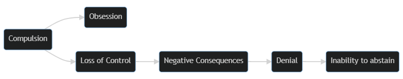

### What Is Addiciton?

  <h4>Terms</h4>
  <ul>
    <li><abbr title="continued involvement with a substance or activity despite ongoing negative consequences.">Addiction</abbr></li>
    <li><abbr title="The adaptive state of brain and body processes that occurs with regular addictive behaviour and results in withdrawal if the addictive behaviour stops.">Physiological Dependence</abbr></li>
    <li><abbr title="A requirement for increased amounts of a drug in order to achieve the desired effect">Tolerance</abbr></li>
    <li><abbr title=" a series of temporary physical and psychological symptoms that occurs when substance use stops.">Withdrawal</abbr></li>
    <li><abbr title="Dependency of the mind on a substance or behaviour, which can lead to psychological withdrawal symptoms such as anxiety, irritability, or cravings.">Physiological Dependence</abbr></li>
  </ul>

#### Common Characteristics of Addiction

Although the mechanism is not well understood, all forms of addiction probably reflect dysfunction of certain biochemical systems in the brain.

-   **Compulsion**: An excessive preoccupation (characterised by **obsession**) with a behaviour and an overwhelming need to engage in an activity.
-   **Loss of Control**: An inability to realistically estimate the consequences (healthy or damaging) of a particular behaviour.
-   **Negative consequences**: physical damage, legal trouble, financial problems, academic failure or family dissolution.
-   **Denial**: inability to perceive that a behaviour is self-destructive
-   **Inability to Abstain**

